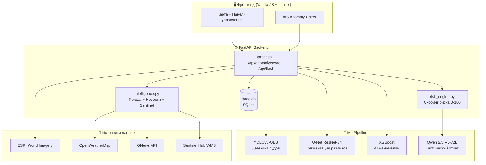

<div align="center">


<br/>

[](https://python.org)
[](https://fastapi.tiangolo.com)
[](https://pytorch.org)
[](https://xgboost.readthedocs.io)
[](https://ultralytics.com)
[](LICENSE)
[]()

<br/>

> **TRACE** — это платформа морской разведки на основе ИИ.  
> Спутниковые снимки → детекция судов → AIS-аномалии → тактический отчёт.

<br/>


</div>

---

## 📋 Содержание

- [🎯 Возможности](#-возможности)
- [🏗️ Архитектура](#%EF%B8%8F-архитектура)
- [⚡ Быстрый старт](#-быстрый-старт)
- [🔧 Конфигурация](#-конфигурация)
- [🤖 ML-модели](#-ml-модели)
- [🌐 API-эндпоинты](#-api-эндпоинты)
- [📁 Структура проекта](#-структура-проекта)
- [🗄️ База данных](#%EF%B8%8F-база-данных)
- [📦 Зависимости](#-зависимости)
- [🚀 Деплой](#-деплой)
- [📄 Лицензия](#-лицензия)

---

## 🎯 Возможности

<table>
<tr>
<td width="50%">

### 🛰️ Детекция судов
- **YOLOv8-OBB** — обнаружение судов со спутниковых снимков
- Поддержка **оптического** и **SAR-радарного** режимов
- Автоматическое скачивание тайлов ESRI
- GPS-геолокация каждого судна по пикселям
- Водяная маска для фильтрации суши

### 🔴 Обнаружение разливов нефти
- **U-Net** на энкодере ResNet-34
- Сегментация SAR/оптических снимков
- Расчёт площади разлива в м²
- Полигоны для отрисовки на карте

</td>
<td width="50%">

### 🚨 AIS-аномалии (НОВОЕ)
- **XGBoost** бинарный классификатор
- ROC-AUC ≈ **0.9999** на 7.1M пингов
- Детектирует: пробелы > 20 мин, невозможную скорость (> 60 уз), резкие манёвры, движение с якорным статусом
- Компактная форма ввода прямо в UI

### 🌐 Разведывательный слой
- Погода в реальном времени (OpenWeatherMap)
- Новостной тикер из региона
- Sentinel-2 / Sentinel-1 через Sentinel Hub WMS
- Тактический отчёт от **Qwen 2.5-VL-72B**

</td>
</tr>
</table>

---

## 🏗️ Архитектура



---

## ⚡ Быстрый старт

### 1. Клонирование репозитория

```bash
git clone https://github.com/YOUR_USERNAME/TRACE-Satellite-AI.git
cd TRACE-Satellite-AI
```

### 2. Создание виртуального окружения

```bash
python -m venv venv

# Windows
venv\Scripts\activate

# Linux / macOS
source venv/bin/activate
```

### 3. Установка зависимостей

```bash
pip install -r requirements.txt

# Дополнительно для AIS-аномалий
pip install xgboost scikit-learn
```

### 4. Настройка переменных окружения

```bash
cp .env.example .env
# Откройте .env и заполните HF_TOKEN
```

### 5. Запуск сервера

```bash
cd src
uvicorn app:app --host 0.0.0.0 --port 8000 --reload
```

Откройте браузер: **http://localhost:8000**

---

## 🔧 Конфигурация

Создайте файл `.env` в корне проекта:

```env
# Обязательно
HF_TOKEN=hf_xxxxxxxxxxxxxxxxxxxxxxxxxxxxxxxxxxxxxxxx
```

| Переменная | Описание | Обязательно |
|---|---|---|
| `HF_TOKEN` | HuggingFace API токен для Qwen 2.5-VL-72B | ✅ Да |

> **Получение HF_TOKEN:**  
> Зарегистрируйтесь на [huggingface.co](https://huggingface.co) → Settings → Access Tokens → New token (PRO требуется для Qwen 72B)

---

## 🤖 ML-модели

### Файлы моделей (`models/`)

| Файл | Модель | Назначение | Размер | Источник |
|---|---|---|---|---|
| `best.pt` | YOLOv8n-OBB | Детекция судов | ~22 MB | 📦 GitHub Release |
| `best_unet_sos.pth` | U-Net ResNet-34 | Сегментация разливов нефти | ~93 MB | 📦 GitHub Release |
| `anomaly_xgb.json` | XGBoost | Бинарный AIS-скоринг аномалий | ~3.5 MB | ✅ В репозитории |

> [!IMPORTANT]
> Веса **YOLOv8** и **U-Net** слишком большие для Git и **не включены в репозиторий**.  
> Скачайте их из **[GitHub Releases → TRACE MVP AI Model Weights](https://github.com/sronters/TRACE-Satellite-AI/releases/latest)** и поместите в папку `models/`.

```bash
# Быстрая установка весов (Windows PowerShell)
New-Item -ItemType Directory -Force -Path models
# Скачать best.pt и best_unet_sos.pth из раздела Releases вручную
# или через gh CLI:
gh release download --repo sronters/TRACE-Satellite-AI --dir models
```

### 📊 Метрики AIS-модели

Обучение на AIS-данных за 2022-03-31 (7 167 046 пингов, 114 382 аномалий).

| Метрика | Среднее по 5 фолдам |
|---|---|
| Accuracy | **99.97%** |
| Precision | **98.13%** |
| Recall | **99.95%** |
| F1-Score | **99.03%** |
| ROC-AUC | **99.9997%** |

### Признаки аномалий (XGBoost)

```
MMSI · LAT · LON · SOG · COG · Heading · VesselType · Status
Length · Width · Draft · Cargo

Вычисляемые:
  dt_min           → временной разрыв между пингами (мин)
  dist_nm          → дистанция между пингами (морские мили)
  implied_speed_kn → расчётная скорость (уз)
  delta_heading    → резкий поворот (°) — 1 пинг назад
  delta_heading_2min → поворот (°) — 2 пинга назад
  speed_diff       → разница SOG и расчётной скорости
  turn_rate        → скорость поворота (°/мин)
  is_fast          → SOG > 20 уз (бинарный)
```

**Условия аномалии (`label = 1`):**
- 🕐 Пропуск сигнала > **20 минут**
- ⚡ Расчётная скорость > **60 узлов** (физически невозможно)
- 🔄 Поворот > **120°** за 2 пинга при скорости > 10 уз
- ⚓ Статус "на якоре" (1 или 5) при скорости > **3 узлов**

---

## 🌐 API-эндпоинты

### Основные

| Метод | Путь | Описание |
|---|---|---|
| `GET` | `/` | Веб-интерфейс |
| `GET` | `/health` | Статус сервисов |
| `POST` | `/process` | Анализ изображения или координат |

### AIS-аномалии

```http
POST /api/anomaly/score
Content-Type: application/json

{
  "lat": 29.7876,
  "lon": -95.0807,
  "sog": 65.0,
  "heading": 226,
  "status": 0,
  "mmsi": 367702220,

  // Опционально: предыдущий пинг
  "prev_lat": 29.770,
  "prev_lon": -95.065,
  "prev_heading": 220,
  "prev_dt_min": 5.0
}
```

**Ответ:**
```json
{
  "is_anomaly": true,
  "probability": 0.9873,
  "label": "ANOMALY"
}
```

### Флот и порты

| Метод | Путь | Описание |
|---|---|---|
| `GET` | `/api/fleet` | Список флота |
| `POST` | `/api/fleet/import/json` | Импорт флота из JSON |
| `POST` | `/api/fleet/import/csv` | Импорт флота из CSV |
| `DELETE` | `/api/fleet/{id}` | Удалить судно |
| `GET` | `/api/ports` | Список портов |
| `POST` | `/api/ports` | Добавить порт |

### История и аналитика

| Метод | Путь | Описание |
|---|---|---|
| `GET` | `/api/history` | История анализов |
| `GET` | `/api/analysis/{id}` | Детали конкретного анализа |
| `GET` | `/api/alerts` | Активные алерты |
| `GET` | `/api/stats` | Статистика системы |
| `GET` | `/api/vessels/heatmap` | Тепловая карта судов |
| `GET` | `/api/intel` | Разведывательные данные по координатам |
| `GET` | `/api/route` | Морской маршрут между точками |

---

## 📁 Структура проекта

```
TRACE-Satellite-AI/
│
├── 📂 src/
│   ├── app.py              # FastAPI сервер + все эндпоинты
│   ├── intelligence.py     # Погода, новости, Sentinel Hub
│   ├── risk_engine.py      # Движок расчёта риска (0-100)
│   ├── anomaly_scorer.py   # XGBoost AIS-аномалии ← НОВОЕ
│   ├── database.py         # SQLite: история, алерты, статистика
│   ├── fleet.py            # Реестр флота и портов
│   └── index.html          # SPA фронтенд (Leaflet + Vanilla JS)
│
├── 📂 models/
│   ├── best.pt             # YOLOv8n-OBB веса
│   ├── best_unet_sos.pth   # U-Net ResNet-34 веса
│   └── anomaly_xgb.json    # XGBoost AIS-классификатор
│
├── 📂 notebooks/
│   ├── trace-anomaly-xgb.ipynb   # Обучение AIS-модели
│   ├── oilspill-segmentation.ipynb
│   └── yolo8n-dota.ipynb
│
├── 📂 docs/
│   └── TECHNICAL_DETAILS.md  # Полная техническая документация (RU)
│
├── .env                 # Секреты (не в git!)
├── .env.example         # Пример конфигурации
├── .gitignore
├── requirements.txt
└── README.md
```

---

## 🗄️ База данных

TRACE использует **SQLite** (`trace.db`). Основные таблицы:

```sql
analyses    — история всех анализов (координаты, детекции, риск)
alerts      — сгенерированные алерты с подтверждением
fleet       — реестр судов флота
ports       — реестр портов с радиусами
```

---

## 📦 Зависимости

```txt
fastapi                    # Web-фреймворк
uvicorn[standard]          # ASGI-сервер
python-multipart           # Загрузка файлов
python-dotenv              # .env файлы
ultralytics                # YOLOv8
torch + torchvision        # PyTorch (GPU/CPU)
Pillow                     # Обработка изображений
numpy                      # Вычисления
httpx                      # Async HTTP-клиент
opencv-python-headless     # Компьютерное зрение
segmentation-models-pytorch # U-Net архитектура
huggingface_hub            # HF Inference API

# Для AIS-аномалий:
xgboost                    # Классификатор
scikit-learn               # Препроцессинг
```

---

## 🚀 Деплой

### Docker (рекомендуется)

```dockerfile
FROM python:3.11-slim
WORKDIR /app
COPY requirements.txt .
RUN pip install -r requirements.txt && \
    pip install xgboost scikit-learn
COPY . .
EXPOSE 8000
CMD ["uvicorn", "src.app:app", "--host", "0.0.0.0", "--port", "8000"]
```

```bash
docker build -t trace-v2 .
docker run -p 8000:8000 --env-file .env trace-v2
```

### Systemd (Linux production)

```ini
[Unit]
Description=TRACE Maritime AI
After=network.target

[Service]
WorkingDirectory=/opt/trace
ExecStart=/opt/trace/venv/bin/uvicorn src.app:app --host 0.0.0.0 --port 8000 --workers 2
Restart=always

[Install]
WantedBy=multi-user.target
```

---

## 📄 Лицензия

MIT License © 2024 TRACE Team

---

<div align="center">


[](https://github.com/YOUR_USERNAME/TRACE-Satellite-AI)

</div>
