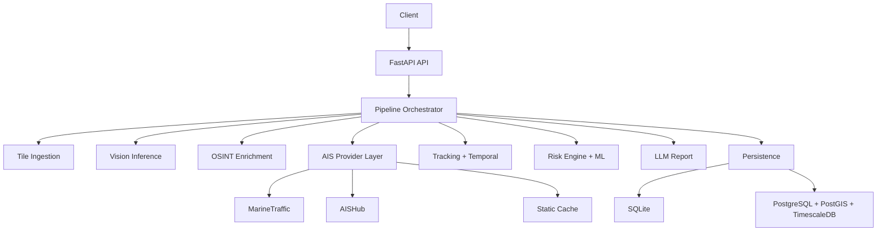

# TRACE

<p align="center">
  
</p>

<p align="center">
  
  
  
  
  
</p>

<p align="center">
  
</p>

Production-grade maritime intelligence API for vessel detection, AIS identity correlation, oil-spill analysis, temporal forecasting, and explainable risk scoring.

---

## Why TRACE

- CV + OSINT + AIS fused into one operational decision stream
- Local-first architecture with optional cloud fallback
- Stateful tracking and trajectory prediction across frames
- Contract-driven ML runtime for safe model upgrades
- Scalable persistence path from SQLite to PostGIS + TimescaleDB

---

## Feature Highlights

- YOLO vessel detection and SAR spill segmentation
- MarineTraffic/AISHub/static AIS provider failover
- AIS-silent vessel flagging and fleet enrichment
- Kalman tracking and temporal movement projection
- Drift forecast for oil spills using wind/current signals
- Change/anomaly detection against AOI history
- Hybrid risk engine (rule-based + optional XGBoost)
- SSE streaming endpoint for real-time pipeline progress
- API key security, optional mTLS gate, audit logging
- Prometheus metrics and health/contract diagnostics

---

## Architecture



---

## Project Layout

```text
TRACEEE/
├── docs/
│   ├── API_REFERENCE.md
│   ├── OPERATIONS.md
│   ├── TECHNICAL_DETAILS.md
│   ├── TRAINING_DATA_GUIDE.md
│   └── V3_UPGRADE.md
├── models/
│   ├── risk_features.json
│   ├── risk_model_meta.json
│   ├── best.pt
│   └── best_unet_sos.pth
├── src/
│   ├── app.py
│   ├── main.py
│   ├── core/
│   │   ├── config.py
│   │   └── http_middleware.py
│   ├── services/
│   │   ├── llm_service.py
│   │   ├── pipeline_service.py
│   │   ├── tile_service.py
│   │   └── vision_service.py
│   ├── ml/
│   │   ├── __init__.py
│   │   ├── artifact_validator.py
│   │   └── feature_contract.py
│   ├── ais.py
│   ├── intelligence.py
│   ├── tracker.py
│   ├── temporal.py
│   ├── change_detection.py
│   ├── risk_engine.py
│   ├── ml_risk.py
│   ├── database.py
│   ├── fleet.py
│   ├── segmentation.py
│   └── index.html
├── requirements.txt
└── .env.example
```

---

## Quick Start

### 1) Install

```bash
pip install -r requirements.txt
```

### 2) Configure

```bash
cp .env.example .env
```

Set at minimum:

```env
TRACE_LLM_PROVIDER=auto
OLLAMA_URL=http://127.0.0.1:11434
OLLAMA_MODEL=qwen2.5:7b-instruct
```

Optional:

```env
HF_TOKEN=
TRACE_API_KEYS=
TRACE_REQUIRE_MTLS=false
TRACE_POSTGRES_DSN=
MARINETRAFFIC_API_KEY=
MARINETRAFFIC_API_URL=
RISK_MODEL_PATH=models/risk_xgb.json
RISK_FEATURES_PATH=models/risk_features.json
RISK_MODEL_META_PATH=models/risk_model_meta.json
```

### 3) Run

```bash
uvicorn src.main:app --host 0.0.0.0 --port 8000 --reload
```

Open:
- API: `http://localhost:8000`
- Health: `http://localhost:8000/health`
- Metrics: `http://localhost:8000/metrics`

---

## API Snapshot

- `POST /process` full synchronous analysis
- `POST /process/stream` SSE stage-by-stage stream
- `GET /api/ml/contract` ML artifact contract status
- `GET /api/history` recent runs
- `GET /api/tracks` active temporal tracks
- `GET /api/intel` OSINT snapshot
- `GET /api/fleet`, `GET /api/ports` fleet registry

See full reference in `docs/API_REFERENCE.md`.

---

## ML Integration Contract

TRACE expects:
- `models/risk_xgb.json`
- `models/risk_features.json`
- `models/risk_model_meta.json`

Validation endpoints:
- `GET /api/ml/contract`
- `GET /health` (`ml_contract` section)

This guarantees feature ordering and safe runtime behavior before loading your trained weights.

---

## Documentation Index

- Technical architecture: `docs/TECHNICAL_DETAILS.md`
- API specification: `docs/API_REFERENCE.md`
- Deployment and operations: `docs/OPERATIONS.md`
- Training data and labeling: `docs/TRAINING_DATA_GUIDE.md`
- Upgrade notes: `docs/V3_UPGRADE.md`

---

## Deployment Modes

- Local demo: SQLite + local LLM
- Hybrid: SQLite + external AIS/OSINT + HF fallback
- Production: PostgreSQL/PostGIS/Timescale dual-write + secured API + monitoring

---

## License

MIT
