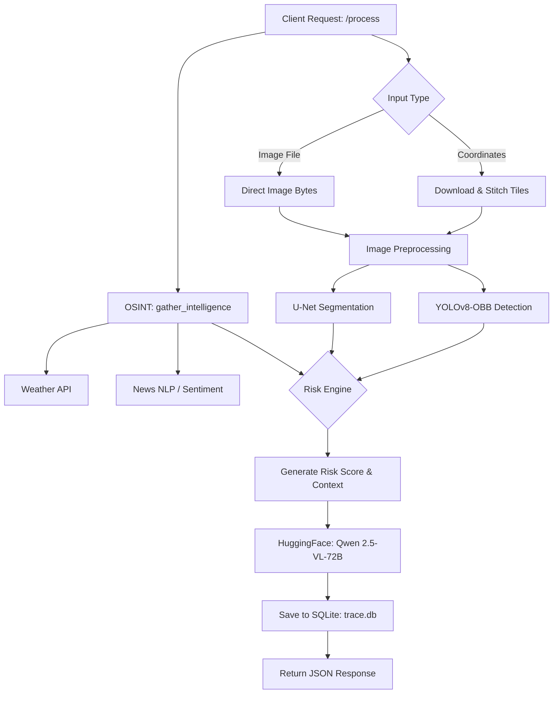

# TRACE v2.0 — Technical Details

## 1. System Architecture Pipeline

The system utilizes parallel asynchronous workers to maximize throughput during an analysis request.



---

## 2. Models Deep-Dive

### YOLOv8-OBB — Vessel Detection
- **Objective**: Detect maritime vessels and determine their precise heading/orientation, correcting for oblique satellite angles.
- **Dataset**: DOTAv1.5 (Aerial imagery).
- **Coordinate Conversion**: The system translates bounding box pixel centroids into precise GPS coordinates using real-time GSD (Ground Sample Distance) calculation.
- **Water Mask Guard**: To prevent false positives (e.g., detecting buildings as ships), a spectral ratio water-mask dynamically limits detections to water bodies.

### U-Net (ResNet34) — Oil Spill Segmentation 
- **Objective**: Pinpoint marine pollution. SAR (Synthetic Aperture Radar) is notoriously noisy; U-Net filters out the backscatter to isolate oil slicks.
- **Architecture**: PyTorch `segmentation_models_pytorch`, utilizing a ResNet34 encoder initialized with ImageNet weights.
- **Loss Strategy**: Trained with a custom `0.5 * BCE + 0.5 * Dice Loss` function to handle severe class imbalance (spills make up <5% of pixels).

---

## 3. The Intelligence Layer (OSINT)

Implemented in `src/intelligence.py`. Validates the environmental context for detections.
- **Meteorological Data**: Open-Meteo API provides instantaneous Wind Speed, Wind Direction, and Wave Height (critical for calculating oil spill drift vectors).
- **Geopolitical News**: Fetches recent headlines related to maritime activity and runs NLP sentiment analysis (`TextBlob`) to weight the baseline geographical risk.

---

## 4. Risk Engine 

Implemented in `src/risk_engine.py`. Computes a standardized 0-100 `RiskScore`.
1. **Base Factor**: Vessel density vs. expected traffic.
2. **Environmental Multiplier**: Severe weather (wind > 30 km/h) increases the risk of grounding or slick spreading.
3. **Pollution Penalty**: Any detected oil spill instantly adds +40 to the base risk.
4. **Geopolitical Overlay**: Negative local news sentiment acts as a multiplier.

---

## 5. Vision-Language Subsystem (Qwen)

The generative reporting relies on `Qwen/Qwen2.5-VL-72B-Instruct` hosted via the HuggingFace Serverless API (`router.huggingface.co/v1/chat/completions`).

### Payload Optimization
Serverless endpoint constraints dictate an 8MB payload limit. The backend aggressively compresses image input:
1. Decode incoming image.
2. Calculate longest edge.
3. If > 1024px, downsample via `LANCZOS` ratio scaling.
4. Re-encode as Base64 JPEG at 82% quality.

### Prompt Engineering
The system injects deterministic data into the zero-shot prompt:
```
System TRACE detected {X} vessels and a {Y} m2 oil spill.
Weather: {Weather string}. Local Sentiment: {Z}.
...
```
This restricts the model's physical hallucinations while allowing it to draw complex tactical correlations.

---

## 6. Data Persistence

The app utilizes a localized `SQLite3` database (`trace.db`) orchestrated through `src/database.py`.
- **`analysis_history`**: Stores serializable JSON blobs of the entire analysis pipeline (detections, OSINT, Qwen report).
- **`alerts`**: High-priority alerts triggered by the Risk Engine (e.g., "Risk > 75: Critical Incident").
- **`fleet` / `ports`**: Registries mapped in `src/fleet.py` to cross-reference detected anomalies against "known friendly" vessels.
